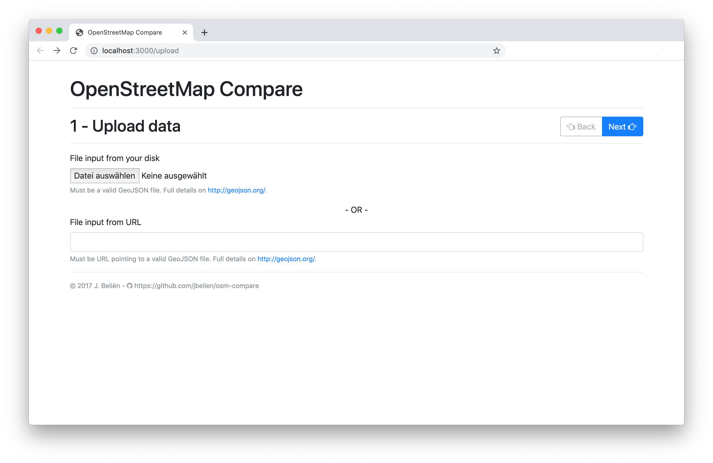
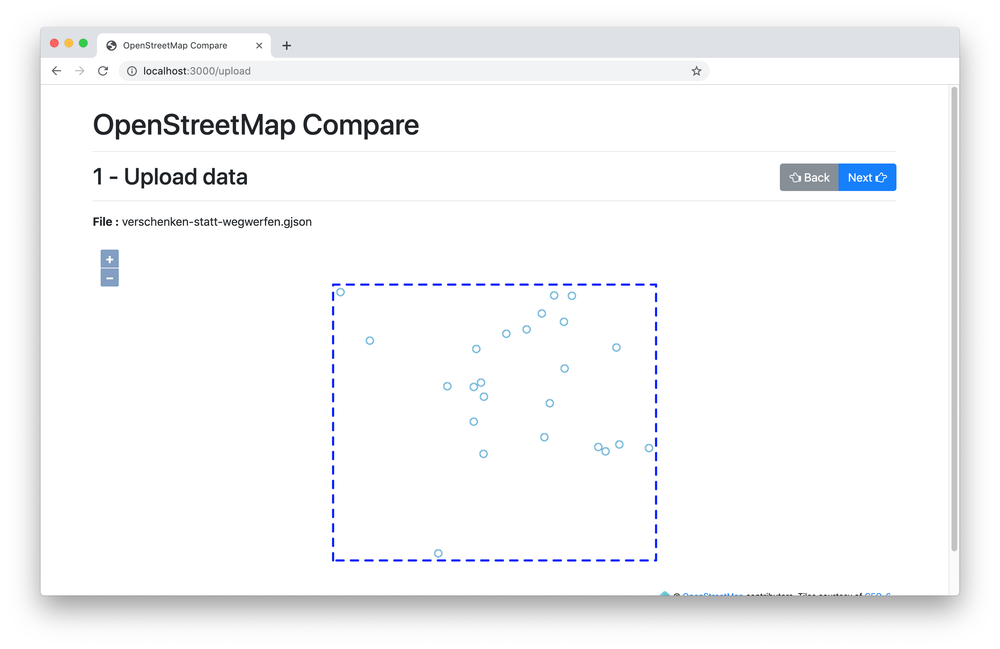
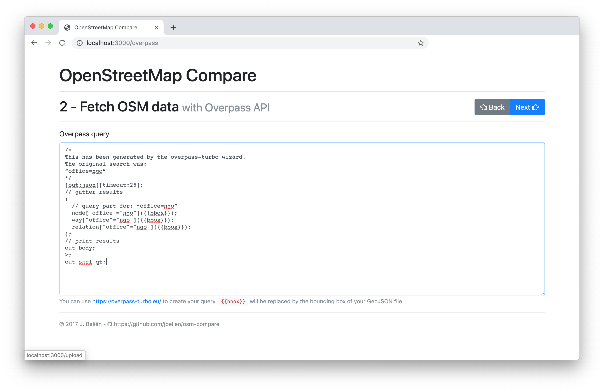
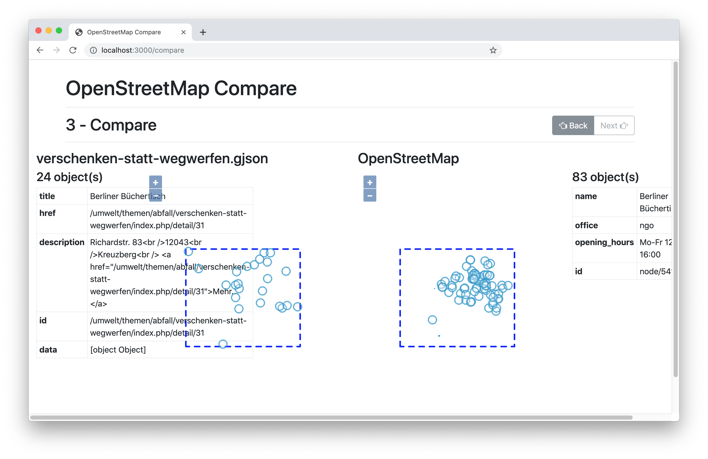

# OpenStreetMap Compare
Compare your GeoJSON file against OpenStreetMap data

## Install & Run

```
git clone https://github.com/jbelien/osm-compare.git
cd ./osm-compare/
npm install
DEBUG=osm-compare:* npm start
```

Go to <http://localhost:3000/upload>

# Feature & Roadmap

See [ROADMAP](ROADMAP.md).


# Screenshots

**Step 1**



**Step 2**



**Step 3**

 

**Step 4**

 
